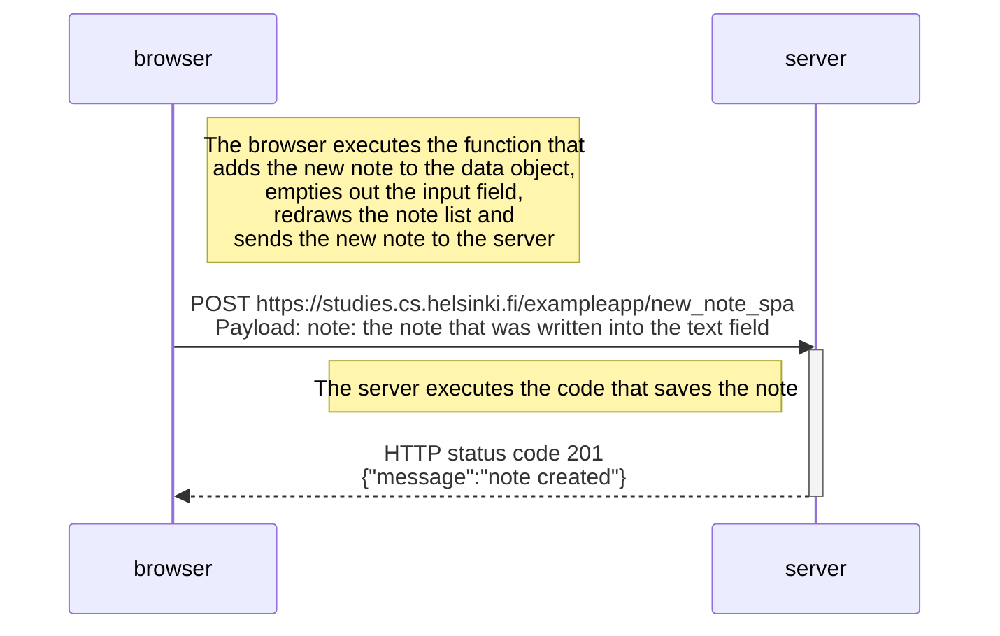

# 0.6 New note in Single page app diagram

Whats happening when

> the user creates a new note using the single-page version of the app.

```mermaid

sequenceDiagram

    participant browser
    participant server

    Note right of browser: The browser executes the function that <br> adds the new note to the data object, <br> empties out the input field, <br> redraws the note list and <br> sends the new note to the server

    browser ->> server: POST https://studies.cs.helsinki.fi/exampleapp/new_note_spa <br> Payload: note: the note that was written into the text field
    activate server

    Note left of server: The server executes the code that saves the note

    server -->> browser: HTTP status code 201 <br> {"message":"note created"}
    deactivate server


```